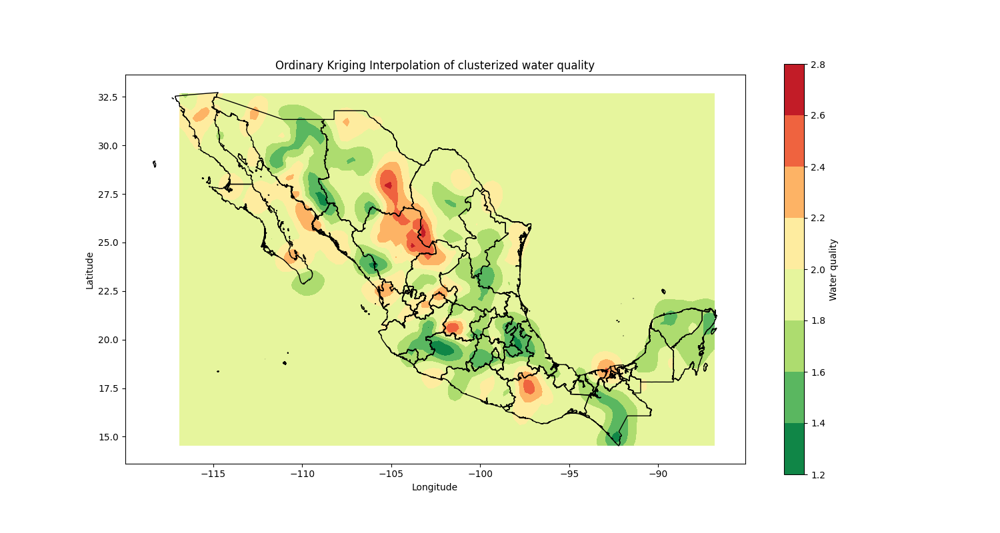

# 💧Water AI💧

Este es un proyecto de inteligencia artificial que tiene como objetivo resolver alguna cuestión relacionada al agua. Este proyecto se dividió en 3 aspectos del agua: el agua que nos falta, el agua que tenemos y el agua que nos sobra. 

Asimismo, este proyecto tiene por objetivo mostrar las habilidades desarrolladas a lo largo de la carrera de Ingeniería en Ciencia de Datos y Matemáticas del Tec de Monterrey


## 👥 Integrantes


## 🔧Tecnologías utilizadas


## 📖Descripción del proyecto

### Agua que nos falta

En este apartado se busca predecir el nivel de sequía en cada Estado de México. 

Como inputs, se usó un dataset de la CONAGUA que contiene información del nivel de sequías en cada municipio del país por quincena desde el 2003 hasta el 2023.

Con base en esto, se realizó un Dashboard con Dash y Plotly que muestra el nivel de sequía en cada Estado de México a lo largo del tiempo. Y con base en esto, se realizó un modelo de Series de Tiempo con Prophet para predecir el nivel de sequía en los siguientes 2 años. Además de mostrar la tendencia y sus respectivos cambios a lo largo del tiempo. 

Este dashboard se encuentra en la carpeta app_sequias o en el siguiente link: [Dashboard Sequías](https://water-ai.onrender.com)
<video width="920" height="340" controls>
    <source src="docs/demo_sequias.mp4" type="video/mp4">
Your browser does not support the video tag.
</video>


### Agua que tenemos

Este apartado busca analizar la calidad del agua subterránea en cada ubcación disponible de México.

Como inputs, se usó un dataset de la CONAGUA que contiene información de la calidad del agua subterránea en cada ubicación de México. Misma que incluye los siguienets contaminantes: 

- Alcalinidad Total, en miligramos por litro
- Arsenico Total, en miligramos por litro 
- Cadmio Total, en miligramos por litro
- Coliformes Fecales, en Numero Mas Probable por 100 mililitros
- Conductividad en microSiemens por centimetro
- Cromo Total, en miligramos por litro
- Dureza Total, en miligramos por litro
- Hierro Total, en miligramos por litro
- Fluoruros Totales (F-), en miligramos por litro
- Mercurio Total, en miligramos por litro
- Manganeso Total, en miligramos por litro
- Nitrogeno de Nitratos, en miligramos por litro
- Plomo Total, en miligramos por litro
- Solidos Disueltos Totales-Medidos, en miligramos por litro
- Solidos Disueltos Totales, en miligramos por litro

Con base en esto, se realizó una reducción de dimensiones a 2 dimensiones con TSNE, y posteriormente se usó un modelo de Clustering con DBSCAN para identificar los clusters de calidad de agua subterránea en México.

Finalmente, una vez asignados los clusters, se realizó una extrapolación con Ordinary Kriging para mostrar la calidad del agua subterránea en todo México.



### Agua que nos sobra

En este apartado se busca identificar zonas inundadas con base en alguna foto.

Como inputs, se usó un dataset de imágenes de zonas inundadas de [Kaggle](https://www.kaggle.com/datasets/faizalkarim/flood-area-segmentation)

Con base en esto, se realizó un modelo de Segmentación de Imágenes DeepLabV3 con TensorFlow para identificar las zonas inundadas en una imagen.

## 📂Estructura de carpetas

```bash
├── app_sequias
│   ├── Es una aplicación de Dash y Plotly que muestra el nivel de sequía en cada Estado de México a lo largo del tiempo
├── data
│   ├── Contiene los datos usados en cada sección del proyecto
├── docs
│   ├── Contiene la documentación del proyecto
├── graphs
│   ├── Contiene los gráficos generados en cada sección del proyecto
├── src
│   ├── Contiene los Notebooks de cada sección del proyecto
```

## 📝Documentación

Finalmente, se realizó un [reporte técnico](docs/Reporte.pdf) que contiene la descripción de cada sección del proyecto, así como los resultados obtenidos en cada una de ellas.

